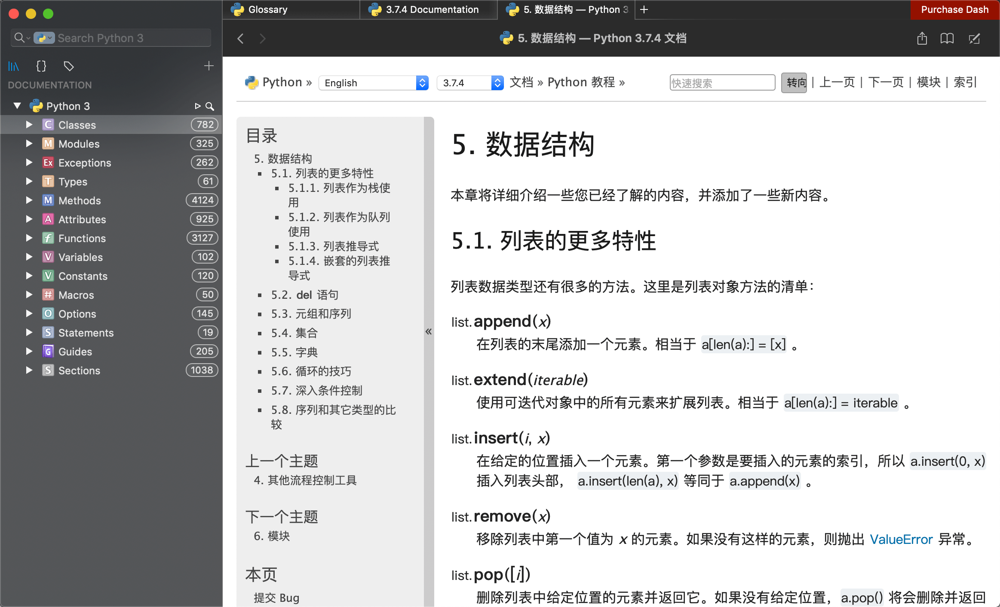

# Dash-docsets-CN

供 [Dash](https://kapeli.com/dash) 使用的中文文档，目前有 PHP，Python 3 和 Laravel 提供，欢迎您参与贡献更多。

>`Windows` 和 `Linux` 用户可配合 [Zeal](http://zealdocs.org/) 使用本文档

## 下载

当前提供以下 Docsets：

* PHP
* Python

请到 [Releases 页面](https://github.com/NauxLiu/Dash-docsets-CN/releases) 下载，解压后双击安装即可。

## 更新记录

#### 2019/9/7
  * 添加 Python3 中文文档
#### 2019/2/26
  * 同步 PHP 文档到了当前官网最新版本

## 效果展示

#### PHP 中文文档效果

#### Python 中文文档效果

